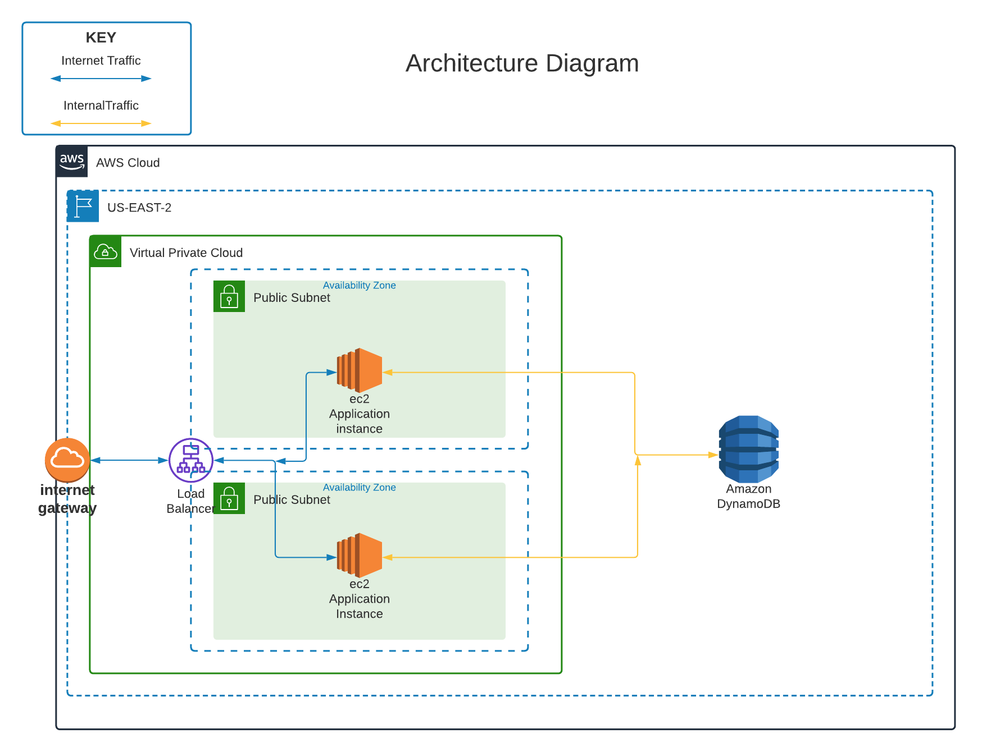
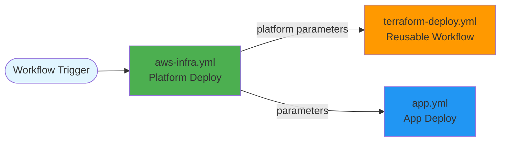
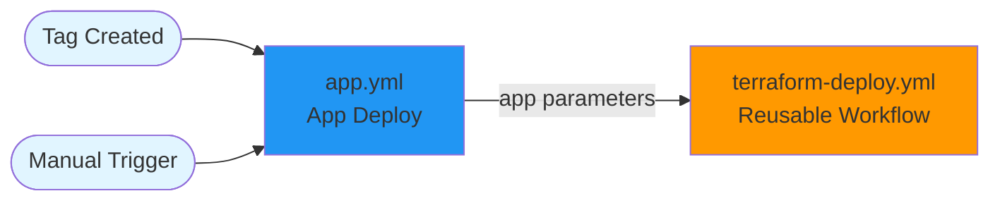
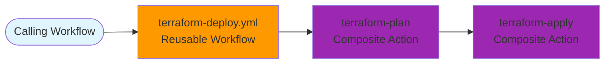

# Resume Converter

Deployed on AWS using Terraform and Docker, in an Auto Scaling group, behind an Application Load Balancer
and fronted with API Gateway.

## Prerequisites

- Python 3.x (for running the app locally)
- AWS CLI configured (`aws configure` or `aws configure sso`)
- Terraform installed
- The `make` command
- Docker installed (for running things locally)
- AWS account, and credentials with permissions for EC2, ECR, DynamoDB, S3, IAM

## Architecture



### Application

- **Language:** Python 3 (Flask)
- **API Endpoints:**
  - `GET /gtg` — Health check
  - `GET /gtg?details` — Detailed health check (queries EC2 IMDSv2 for instance ID)
  - `GET /swagger` — OpenAPI 3 (Swagger) UI (proxies asset sub-paths via `/swagger/{proxy+}`)
  - `POST /convert/docx` — Convert markdown resume to DOCX (**requires `x-api-key` header via API Gateway**)
  - `POST /convert/pdf` — Convert markdown resume to PDF (**requires `x-api-key` header via API Gateway**)

- **Data Store:** AWS DynamoDB
  - Table: `Candidates`
  - Hash Key: `CandidateName`
  - Billing: PAY_PER_REQUEST

- **Containerization:** Docker
  - Multi-stage build
  - Runs as non-root
  - Health check endpoint `/gtg`

### Infrastructure

- **Provisioned with:** Terraform (modular, in `infra/`)
- **Cloud:** AWS (us-east-2)
- **Key Components:**
  - **API Gateway:** Regional REST API fronting the ALB — routes `/gtg`, `/swagger`, `/convert/*`
    - `/convert/docx` and `/convert/pdf` enforce `x-api-key` authentication
    - `/swagger` and `/swagger/{proxy+}` inject `X-Forwarded-Prefix` (stage name) so the app builds correct asset URLs
    - Integrates via HTTP_PROXY to the ALB
  - **VPC:** 2 public subnets (multi-AZ)
  - **EC2:** Auto Scaling Group (t2.micro, free tier)
  - **ALB:** Application Load Balancer (port 80)
  - **ECR:** Docker image registry with lifecycle policy
  - **IAM:** Roles for EC2, OIDC for GitHub Actions
  - **S3 & DynamoDB:** For Terraform state and locking

- **Modules:**
  - `infra/aws/backend/` — Terraform backend state resources
  - `infra/aws/bootstrap/` — Bootstrap IAM/OIDC
  - `infra/aws/platform/` — Core infrastructure (VPC, ECR, ALB, etc.)
  - `infra/aws/app/` — Application runtime (ASG, DynamoDB, API Gateway, etc.)
  - `infra/modules/` — Reusable infra modules (alb, vpc, ecr, dynamodb, apig_api_key, etc.)

## Terraform

### Module Structure

```txt
infra/
├── aws/
│   ├── backend/             # Backend configuration for Terraform state
│   ├── bootstrap/           # Bootstrap module for initial setup (IAM oidc, etc)
│   ├── platform/            # Platform module (foundation resources)
│   └── app/                 # Application module (runtime resources)
└── modules/
    ├── alb/                 # Application Load Balancer
    |-- backend/             # Backend configuration for Terraform state
    ├── docker/              # Docker build and push
    ├── apig_api_key/        # API Gateway API key + usage plan
    ├── dynamodb/            # DynamoDB table
    ├── ec2/                 # EC2 multi-purpose module
    ├── ecr/                 # Elastic Container Registry
    |-- s3_state/            # S3 bucket setup for Terraform state
    └── vpc/                 # Virtual Private Cloud
```

### Deploy Backend and Bootstrap (Required)

> [!IMPORTANT]
> This section is **required** before deploying platform or app infrastructure.

#### Environment Variables

Set these before running locally:

```bash
export AWS_DEFAULT_REGION=us-east-2
export AWS_ACCESS_KEY_ID=your_access_key
export AWS_SECRET_ACCESS_KEY=your_secret_key
```

> [!NOTE]
> The above provides a minimal setup; You may use whatever authorization technique you prefer.

The project uses a Makefile to simplify infrastructure deployment. The following commands are available for setting up
the bootstrap and backend layers:

#### 1. Initial Setup (`make`)

Runs the initial setup: *virtual environment*.

```bash
make
```

#### 2. Deploy Backend and Bootstrap (`make backend bootstrap`)

Sets up the bootstrap and backend infrastructure, including:

- IAM roles and OIDC provider for GitHub Actions
- S3 Buckets and DynamoDb tables for Terraform state management

```bash
make backend bootstrap
```

> [!TIP]
> You can run `make help` to see all available Makefile targets and their descriptions.

### Documentation

For implementation details of each parent module in the `aws` directory, see the full documentation for each parent module:

- [backend](./infra/aws/backend/README.md)
- [bootstrap](./infra/aws/bootstrap/README.md)
- [platform](./infra/aws/platform/README.md)
- [app](./infra/aws/app/README.md)

For implementation and usage details of the `modules` directory, see the full [documentation](./infra/modules/) for
each module:

- [alb](./infra/modules/alb/README.md)
- [apig_api_key](./infra/modules/apig_api_key/README.md)
- [backend](./infra/modules/backend/README.md)
- [docker](./infra/modules/docker/README.md)
- [platform](./infra/modules/platform/README.md)
- [dynamodb](./infra/modules/dynamodb/README.md)
- [ec2](./infra/modules/ec2/README.md)
- [ecr](./infra/modules/ecr/README.md)
- [s3_state](./infra/modules/s3_state/README.md)
- [vpc](./infra/modules/vpc/README.md)

## CI/CD: GitHub Workflows and Actions

### Overview

This project uses GitHub Actions to provision (deploy) the platform and application infrastructure, as well as the
application itself.

> [!IMPORTANT]
> The [Deploy Backend and Bootstrap](#deploy-backend-and-bootstrap-required) step(s) must be run first.

### OIDC and AWS Authentication

- **OIDC Role Assumption:**
  - Workflows use `aws-actions/configure-aws-credentials` with `role-to-assume` for secure, short-lived AWS credentials.
  - Trust policy must allow GitHub OIDC provider and correct repository/branch/workflow.

### Example: How Workflows and Actions Work Together

#### 1. Platform Deploy (`aws-infra.yml`)



#### 2. App Deploy (`app.yml`)



#### 3. Reusable Workflow (`terraform-deploy.yml`)



---

## Contributing :computer:

See [CONTRIBUTING.md](CONTRIBUTING.md) for information on contributing to this project.

---

## License :card_index:

This project © 2026 by [Andrew Haller](https://github.com/andrewhaller) is licensed under the [MIT License](https://opensource.org/license/mit).
See the [LICENSE](LICENSE) file for details.
